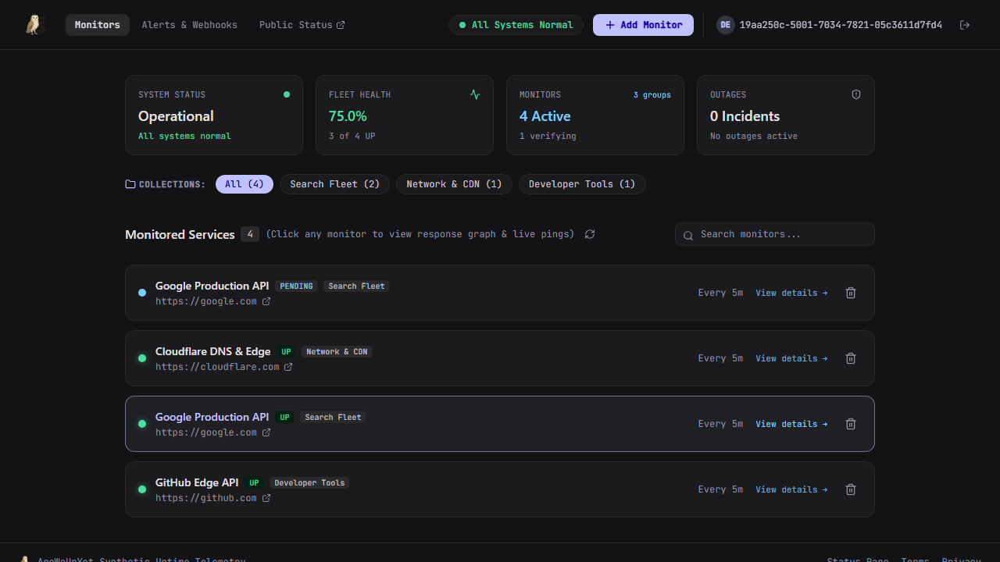
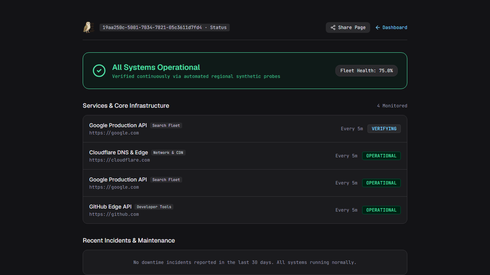
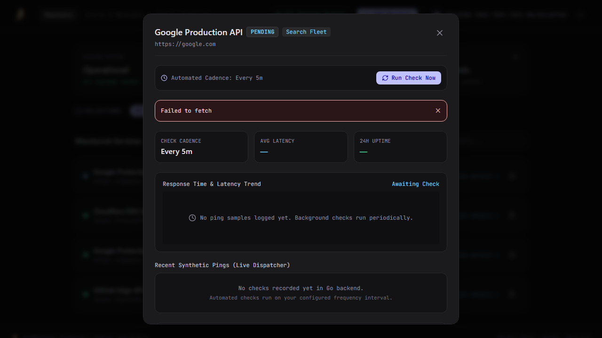
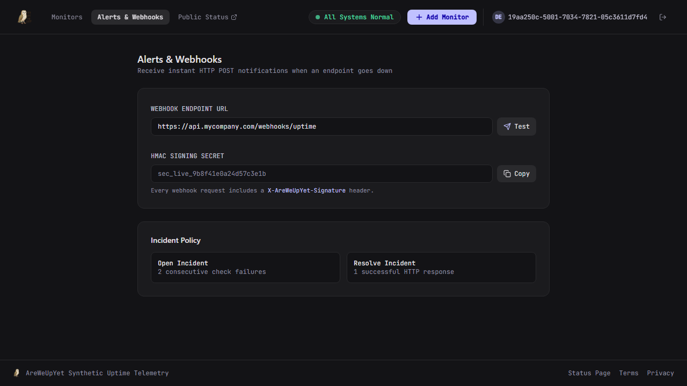



  

<h1 align=center>AreWeUpYet</h1>

  <strong>Multi-tenant synthetic uptime monitoring SaaS engineered to run indefinitely within the AWS Always-Free Tier ($0.00/mo).</strong>

  
  
  
  
  
  

---

## Overview

**AreWeUpYet** is a production-grade synthetic uptime monitoring platform. It continuously evaluates HTTP(S) endpoint availability, records response latency trends, opens/resolves incidents with asymmetric thresholds, and delivers HMAC-signed webhook alerts—all without incurring AWS infrastructure costs.

### Core Highlights

- **Zero Compute Cost**: Operates entirely within AWS Lambda, DynamoDB, and CloudFront always-free allowances.
- **SSRF Defense-in-Depth**: Blocks private, loopback, link-local, carrier-grade NAT, and cloud metadata (169.254.169.254) addresses at DNS lookup and raw socket connection time.
- **View-Only Public Status Pages**: Shareable dashboards (/#/status/:tenantId) with automatic 30-second polling and unauthenticated read access.
- **Cryptographic Webhook Delivery**: HMAC-SHA256 signatures (X-AreWeUpYet-Signature) with exponential retry backoff.
- **Multi-Tenant Isolation**: Amazon Cognito User Pool authentication with strict tenant-scoped data partitioning.

---

## Visual Interface

| Authenticated Telemetry Dashboard | Public View-Only Status Page |
|:---:|:---:|
|  |  |
| *Live operational health, monitor fleet cards, and collection filters* | *Real-time unauthenticated status page auto-refreshing every 30s* |

| Latency Trend & Probe Inspector | Alerts & HMAC Webhook Config |
|:---:|:---:|
|  |  |
| *SVG latency trends, 24h/7d/30d uptime accounting, latest 5 pings* | *Webhook payload signing secret with immediate test dispatch* |

---

## Architecture

`	ext
GitHub Push ──► AWS Amplify Gen 2 (CI/CD)
                     ├─ Frontend: React SPA (Vite + Tailwind CSS on CloudFront)
                     └─ Backend: In-Repo CDK Definition (amplify/backend.ts)
                          ├─ Cognito User Pool: Multi-tenant auth & session tokens
                          ├─ DynamoDB Tables: Endpoints, PingResults (90d TTL), Incidents
                          └─ Go Lambda Functions (provided.al2023, x86_64):
                               ├─ Dispatcher   ── EventBridge rate(1m) ──► DueCheck GSI scan & pings
                               ├─ ApiPrivate   ── Function URL (Cognito) ──► Monitor CRUD & manual checks
                               ├─ ApiPublic    ── Function URL (Open)   ──► Public status & history
                               └─ Notifier     ── Event worker          ──► HMAC signed webhooks
`

### AWS Always-Free Cost Breakdown

| Service | Monthly Usage (1 Tenant, 20 Probes @ 5m) | AWS Always-Free Allowance | Net Cost |
|:---|:---|:---|:---:|
| **AWS Lambda** | ~63,000 invocations · ~4,000 GB-seconds | 1,000,000 requests · 400,000 GB-s | **$0.00** |
| **Amazon DynamoDB** | ~0.26 GB storage · 173K writes · 68K reads | 25 GB storage · 2.5M reads · 1M writes | **$0.00** |
| **Amazon Cognito** | < 10 active administrators | 50,000 MAU | **$0.00** |
| **Lambda Function URLs** | Direct HTTP invocations (No API Gateway) | $0.00 per-request baseline | **$0.00** |
| **Amazon EventBridge** | 43,200 scheduled ticks (1-minute cadence) | Always Free | **$0.00** |
| **CloudWatch Alarms** | 1 metric alarm (Dispatcher error monitoring) | 10 metric alarms | **$0.00** |
| **Amplify Hosting** | Client-side static SPA bundle (~340 KB) | 15 GB bandwidth | **$0.00** |
| **Total** | | | **$0.00/mo** |

---

## Security & Anti-Abuse Controls

1. **SSRF Guard (internal/ssrfguard)**: Prohibits requests to 127.0.0.0/8, 10.0.0.0/8, 172.16.0.0/12, 192.168.0.0/16, 169.254.0.0/16 (AWS IMDS), and loopback IPv6 (::1). Enforces connect-time IP re-verification to neutralize DNS rebinding attacks.
2. **Production Identity Scoping**: Lambda functions derive 	enantId exclusively from verified Cognito JWT sub claims. Unauthenticated requests attempting to supply arbitrary X-Tenant-ID headers are rejected with HTTP 401 Unauthorized.
3. **Multi-Tier Rate Limiting**:
   - **Manual Probes**: 30-second cooldown per endpoint + 5-second workspace-wide cooldown (HTTP 429 with Retry-After).
   - **Webhook Tests**: Maximum 2 outbound dispatches per 10 seconds per tenant.
   - **Public Status API**: Sliding-window limiter (60 req/min per client IP) protecting DynamoDB read throughput.
4. **Optimistic Overlap Locking**: Dispatcher conditional updates (DueCheck GSI) ensure overlapping Lambda invocations never duplicate probe executions.

---

## Quickstart

### Prerequisites
- **Go** >= 1.22
- **Node.js** >= 20 & **npm** >= 10

### 1. Local Development
`ash
# Clone repository
git clone https://github.com/pjpangilinan/areweupyet.git
cd areweupyet

# Install dependencies
npm ci
cd frontend && npm ci && cd ..

# Start local backend (port 8080, in-memory store, 10s synthetic ticker)
npm run dev:backend

# In a separate terminal, start frontend (port 5173)
npm run dev:frontend
`

### 2. Run Test Suite
`ash
# Execute all Go package tests
npm run test:go

# Execute frontend TypeScript check & Vite build
npm run build:frontend
`

### 3. Standalone CLI Pinger (Zero AWS Dependency)
`ash
go build -o pinger ./cmd/pinger
./pinger https://example.com
`

---

## API Reference

### Private API (ApiPrivateFunction · Cognito Bearer Auth)

| Method | Endpoint | Description | Rate Limit |
|:---|:---|:---|:---:|
| GET | /endpoints | List tenant's configured monitors | Standard |
| POST | /endpoints | Create new monitor (max 20 per tenant) | Standard |
| GET | /endpoints/{id} | Inspect monitor details | Standard |
| PUT | /endpoints/{id} | Update URL, name, cadence, or timeout | Standard |
| DELETE| /endpoints/{id} | Cascade delete monitor, pings, and incidents | Standard |
| POST | /endpoints/{id}/check| Trigger immediate synthetic probe | 30s per endpoint / 5s tenant |
| POST | /settings/webhook/test| Dispatch test webhook to external URL | 2 per 10s |

### Public API (ApiPublicFunction · Unauthenticated Read)

| Method | Endpoint | Description | Rate Limit |
|:---|:---|:---|:---:|
| GET | /status/{tenantId} | Public system health & monitored services summary | 60 req/min per IP |
| GET | /status/{tenantId}/endpoints/{id}/history | Availability metrics (24h/7d/30d), timeline, latest 5 pings | 60 req/min per IP |

### Webhook Delivery Specification

Payloads are delivered via POST with Content-Type: application/json and signed with an HMAC-SHA256 token:

`json
{
  event: incident.opened,
  tenantId: c97a151c-d091-7089-88a9-7a8eee8689b8,
  endpointId: 7a59d40e9d167914,
  endpointUrl: https://d1cdomhzh1pe4j.cloudfront.net,
  incidentId: inc-4a2f8b1c,
  startedAt: 2026-09-09T15:14:11Z,
  resolvedAt: null,
  durationSeconds: 0
}
`

`http
X-AreWeUpYet-Signature: sha256=d2c67f8a9e0b1c2d3e4f5a6b7c8d9e0f1a2b3c4d5e6f7a8b9c0d1e2f3a4b5c6d
`

---

## License

Distributed under the **MIT License**. See [LICENSE](LICENSE) for terms.
